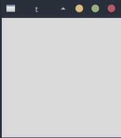
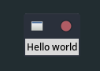
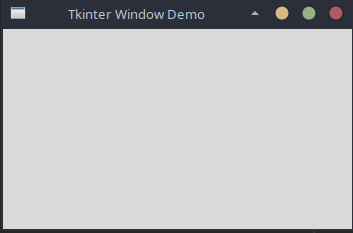
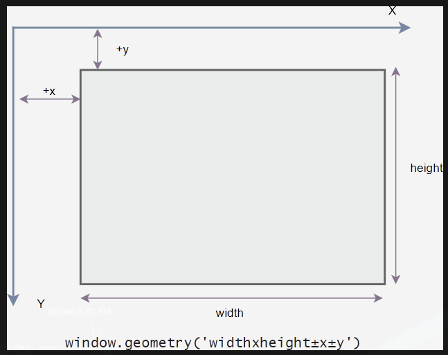

# Tkinter

This "Materi Tkinter" introdues you to the exciting world of GUI programming in Python.

Tkinter is pronounced as tea-kay-inter. Tkinter is the Python interface to Tk. Which is the GUI for Tci/Tk.

Tk is an open-source, cross-platform widget toolkit used by many different programming languages to build GUI programs.

Tkinter is a good choise because of the following resons:

- Easy to lern.
- Use very little code to make a functional desktop application.
- Layered design.
- Portable across all operating systems including Windows, macOS, and Linux.
- Pre-installed with the standard Python library.

## Section 1 Tkinter Fundamentals

### Tkinter Hello, World!

Show you how to develop the first Tkinter program called Hello, World!

---

**Creating a window**

The following program shows how to display a window on the screen:

```python
import tkinter as tk

root = tk.Tk()
root.mainloop()
```

If you execute the program, you'll see the following window:



How it works ? First, import the `tkinter` module as `tk` to the program:

```python
import tkinter as tk
```

Second, create an instance the `tk.Tk` class that will create the application window:

```python
root = rk.Tk()
```

By convention, the main window in Tkinter is called `root`. But you can use any other name like `main`.

Third, call the `mainloop)` method of the main window object:

```python
root.mainloop()
```

The `mainloop()` keeps the window visible on the screen. if you don't call the `mainloop()` method, the window will display and disappear immediately. It will be so fast that you way not see its appearance.

Also, the `mainloop()` method keeps the window displaying and running until you close it.

Typically, you place the call to the `mainloop()` method as the last statement in a Tkinter program, after creating the widgets.

---

**Displaying a Label**

Now, it's time to place a component on the window. In `Tkinter`, component are called **widgets**.

The following adds a `label` tot the root window:

```python
import tkinter as tk


root = tk.Tk()

# place a label on the root window
message = tk.Label(root, text="Hello, World!")
message.pack()

# keep the window displaying
root.mainloop()
```

Note that you'll lern more about the `Label` widget in the upcoming tutorial.

If you run the the program, you'll see the following ouput:



How it works.

To create a widget that belong tp a container, you use the following syntax:

```
widget = WidgetName(container, **opio, **options)
```

In this syntax:

- The `container` is the parent _window_ or _frame_ that you want to place the widget.
- The `options` is one or more _keyword arguments_ that specify the configurations of the widget.

In the program, the following creates a `Label` widget placed on the `root` window:

```python
message = tk.Label(root, text="Hello, World!")
```

And the following statement positions the `Label` on the main window.

```python
message.pack()
```

Note that you'll learn more about the `pack()` method later. If you don't call `pack()` method, the Tkinter still creates the widget. However, te widget is invisible.

---

**Summary**

- Import `tkinter` module to create a Tkinter desktop application.
- Use `Tk` class to create the main window and call the `mainloop()` method to keep the window displays.
- In Tkinter, components are called widgets.

### Tkinter Window

**Summary**: in this tutorial you'll learn how to manipulate various attributes of a Tkinter window. Let's start with a simple program that consists of a window:

```python
import tkinter as tk

root = tk.Tk()
root.mainloop()
```


The root window has a title defaults to `tk`. It also has three system buttons including Minimize, Maximize, and Close. Let's learn how to change the attributes of the root window.

---

**Changing The Window Title**

To change the window's title, you use the `title()` method like this:

```
window.title(new_title)
```

For example, the following changes the title of the root window to `'Tkinter Window Demo'`:

```python
import tkinter as tk

root = tk.Tk()
root.title('Tkinter Window Demo')

root.mainloop()
```

Output :



To get the current title of a window, you use the `title()` method no argument:

```
title = window.title()
```

---

**Changing window size and location**

In Tkinter, the position and size of a window on the screen is determined by _geometry_. The following shows the geometry specification:

```
widthxheight±x±y
```



In this specification:

- The `width` is the window's width in pixels.
- The `height` is the window's height in pixels.
- The `x` is the window's horizontal position. For example, `+50` means the left edge of the window should be 50 pixels from the left edge of the screen. Add `-50` means the right edge of the window should be 50 pixels from the right edge of the screen.
- The `y` is the window's vertial position. For example, `+50` means the top edge of the window should be 50 pixels below the top of the screen. Add `-50` means the bottom edge of the window should be 50 pixels above the bottom of the screen.

To change the size and position of a window, you use the `geometry()` method:

```
window.geometry(new_geometry)
```

The following example changes the size of the window to `600x400` and the position of the window to 50 pixels from the top and left of the screen:

```python
import tkinter as tk

root = tk.Tk()
root.title('Tkinter Window Demo')
root.geometry('600x400+50+50')

root.mainloop()
```

Sometimes, you may want to center the window on the screen. The following program illustrates how to do it:

```python
import tkinter as tk

root = tk.Tk()
root.title("Tkinter Window - Center")

window_width = 300
window_height = 200

# get the screen dimension
screen_width = root.winfo_screenwidth()
screen_height = root.winfo_screenheight()

# find the center point
center_x = int(screen_width/2 - window_width/2)
center_y = int(screen_height/2 - window_height/2)

# set the position of the window to the center of the screen
root.geometry(f"{window_width}x{window_height}+{center_x}+{center_y}")

root.mainloop()
```

How it works?

- First, get the screen width and height using the `winfor_screenwidth()`
- Second, calculate the center coordinate based on the screen and window width and height.
- Finally, set the geometry for the root window using the `geometry()` method.

If you wnat to get the current geometry of a window, you can use the `geometry()` method without providing any argument:

```
window.geometry()
```

---

**Resizeing behavior**

By default, you can resize the width and height of a window. To prevent the window from resizing, you can use the `resizable()` method:

```
window.resizable(width, height)
```

The `resizable()` method has two parameters thhat specify whether the width and height of the window can be resizable.

The following shows how to make the window with a fixed size:

```python
import tkinter as tk

root = tk.Tk()
root.title('TKinter Fixed window')
root.geometry('600x400+50+50')
root.resizable(False, False)

root.mainloop
```

When a window is resizable, you can specify the minimum and mzximum size using the `minsize()` and `maxsize()` method:

```
window.minsize(min_width, min_height)
window.maxsize(max_width, max_height)
```

---

**Transparency**

Tkinter allows you to specify the transparency of a window by setting its alpha channel ranging from 0.0 (fully-transparent) to 1.0 (fully opaque):

```
window.attributes('-alpha', 0.5)
```

The following example illustrates a window with 50% transparent:

```python
import tkinter as tk

root = tk.Tk()
root.title("Tkinter Window Demo")
root.geometry('600x400+50+50')
root.resizable(False, False)
root.attributes('-alpha', 0.5)

root.mainloop()
```

---

**Window Stacking Order**

The window stack order refers to the order of windows placed on the screen from bottom to top. The closer window is on the top of the stack and it overlaps the one lower.

To ensure that a windwo is always at the top of the stacking order, you can use the `-topmost` attribute like this:

```
window.attributes('-topmost', 1)
```


